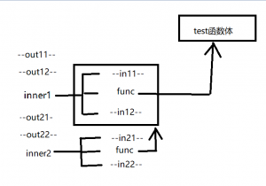

今天总结下 Python 中多个装饰器的执行顺序。

<!--more-->

装饰器代码如下：

```python
def wrapper_out1(func):
    print('--out11--')

    def inner1(*args, **kwargs):
        print("--in11--")
        ret = func(*args, **kwargs)
        print("--in12--")
        return ret
    print("--out12--")
    return inner1


def wrapper_out2(func):
    print('--out21--')

    def inner2(*args, **kwargs):
        print("--in21--")
        ret = func(*args, **kwargs)
        print("--in22--")
        return ret
    print("--out22")
    return inner2


@wrapper_out2
@wrapper_out1
def test():
    print("--test--")
    return 1 * 2


if __name__ == '__main__':
    test()
```

执行后，打印结果如下：

```txt
"""
--out11--
--out12--
--out21--
--out22--
--in21--
--in11--
--test--
--in12--
--in22--
"""
```

执行顺序以图片形式展示如下：




先进入离test函数最近的装饰器，由于装饰器中返回的是函数的函数名引用，并非真正调用函数，所以先打印：

```txt
--out11--
--out12--
--out21--
--out22--
```

到inner2后，func会真正执行函数，会调用 inner1() ,所以再打印：

```txt
--in21--
--in11--
```

到 inner1 中，func 会调用test函数，所以会打印：

```
--test--
```

再从各个函数出来后，会依次打印：

```
--in12--
--in22--
```

合起来就是上面的执行结果。


以上就是多个装饰器的执行顺序。