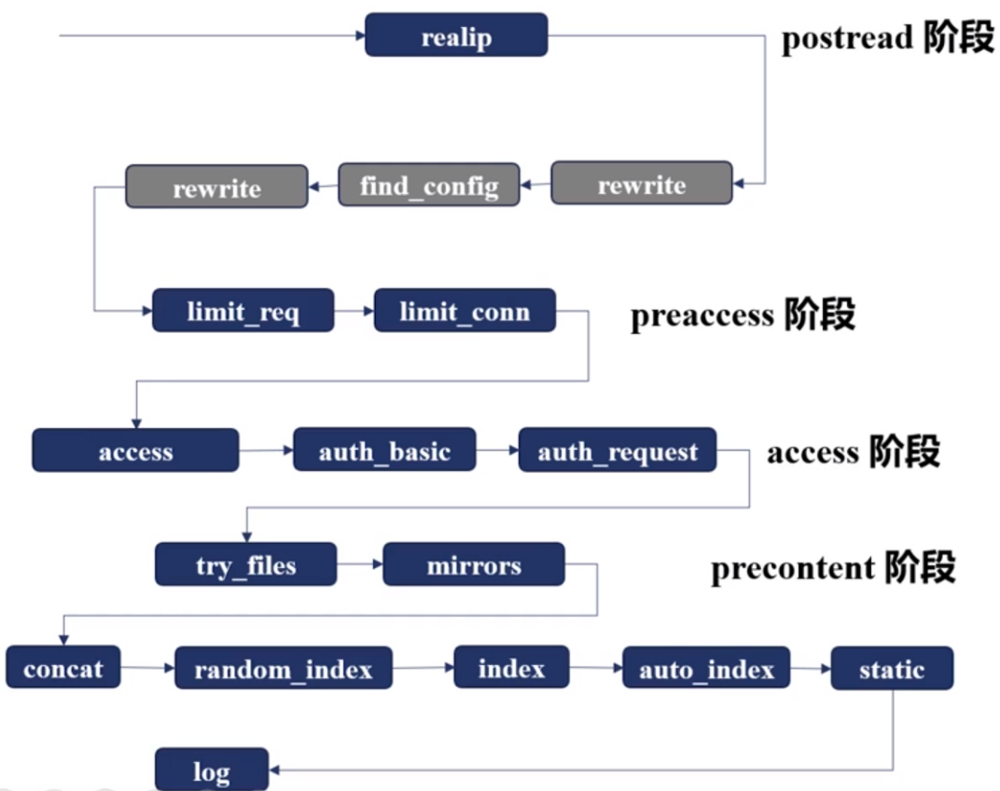

今天总结下 nginx 处理http请求的流程，重点介绍下处理 http 请求的11个阶段。

nginx 处理 http 请求时，首先会对请求行和请求体进行解析，解析完成后进入11 个阶段，这 11 个阶段会根据 nginx.conf 中的配置信息进行相应的重定向、权限控制、日志记录等操作。

<!--more-->

# http请求的11个阶段

```txt
POST_READ：读取到请求头之后会进入该阶段，realip模块在该阶段使用
SERVER_REWRITE：执行server块内，location块外的指令，rewrite 模块在该阶段生效
FIND_CONFIG：根据配置，寻找对应的 location 块并执行
REWRITE：执行 location 块中的重写指令
POST_REWRITE：根据上阶段的重写指令跳转到合适的阶段
PREACCESS：访问权限控制之前的阶段，执行访问频率、连接数等控制
ACCESS：访问权限的控制阶段，例如基于ip黑名单的权限控制
POST_ACCESS：访问权限控制的后一阶段，该阶段根据权限控制阶段的执行结果进行相应处理
PRECONTENT：try_files指令的处理阶段，如果没有配置try_files指令，则该阶段被跳过
CONTENT：内容生成阶段，该阶段产生响应，并发送到客户端
LOG：记录访问日志
```

各个请求阶段的顺序如下：



上面简单介绍了 nginx 处理 http 请求的各个阶段，以及各个阶段使用到的模块（导数第二行是 content 阶段，最后一行是 log 阶段）。下面具体介绍各个阶段的功能。


## POST_READ

解析完请求体后，首先会进入 post_read 阶段，该阶段主要获取客户端真实 ip。

### realip模块

realip 模块在 POST_READ 节点生效，可以用来获取客户端的真实 ip 地址。

在 http 请求中，可以通过请求头中的 X-Forwarded-For 和 X-Real-IP 获取 ip 地址，X-Forwarded-For 中可能保存了多个

ip，X-Real-IP 中保存了客户端的真实 ip。realip 模块会把从 X-Forwarded-For 和 X-Real-IP 获取的值赋值到 nginx 变量 binary_remote_addr 和 remote_addr 中，从而通过这两个变量就能获取客户端真实 ip 地址，后续会进一步做限流、限速等工作（在 limit_conn 模块中）。

realip 模块默认没有编译进 nginx ，可以通过 --with-http_realip_module 参数将其编译进 nginx。

realip 中的指令（具体说明可以查阅官方文档：http://nginx.org/en/docs/http/ngx_http_realip_module.html）

```txt
1. set_real_ip_from addr|CIDR|unix;
作用：设置信任地址，从该地址过来的请求会被获取真实地址，并替换 remote_addr 中的值
例子：set_real_ip_from  192.168.1.0/24|192.168.2.1;
上下文：http, server, location


2. real_ip_header field | X-Real-IP | X-Forwarded-For | proxy_protocol;
作用：从请求头的哪个参数中获取真实ip
例子：real_ip_header X-Real-IP（默认）
上下文：http, server, location


3. real_ip_recursive on | off;
作用：设置为 off 时，匹配信任地址（由 set_real_ip_from 设置）的真实客户端地址会被一个值替换，这个值是 real_ip_header 指定的请求头参数中最后一个值；为 on 时，真实客户端地址会被一个非信任值替代，这个值也是 real_ip_header 指定的请求头参数中的值
```

realip 中指令的配置如下：

```nginx
server {
    server_name realip.wzblogs.cn;
    set_real_ip_from 223.73.212.4;
    real_ip_recursive off;
    # real_ip_recursive on;
    real_ip_header X-Forwarded-For;

    location /{
        return 200 "client real ip is：$remote_addr\n";
    }
}
```

## SERVER_REWRITE

该阶段中，在 server 块内，location 块外的指令会被执行。

### rewrite模块

rewrite 模块在 server_write 阶段生效，该模块主要功能是改变请求 URI，主要有以下指令：

```txt
1. return code URL | return URL | return code [text]
作用：停止请求的访问，并返回给客户端状态码和重定向url
例子：return 302 /redirect_url;
上下文：server, location, if

return 中的一些状态码：
HTTP 1.0：
301 永久重定向（访问站点a时，被重定向到站点b，则下次遇到访问站点a的请求就会直接访问站点b）
302 临时重定向，禁止被缓存（访问站点a时，被重定向到站点b，则下次还会先访问站点a，再被重定向到b）

HTTP 1.1:
303 临时重定向，允许改变请求方法，禁止被缓存
307 临时重定向，不允许改变请求方法，禁止被缓存
308 永久重定向，不允许改变请求方法

error_page 指令与 return 指令的不同
error_page code uri;
作用：nginx接收到指定状态码时，返回特定的页面或者uri
例子： error_page 404 /404.html;|error_page 500 501 502 503 /50x.html;
error_page 404 =200 /empty.gif (接收到404时，返回一张图片，响应状态码是200)
上下文：http, server, location, if in location


2. rewrite regex replacement [flag]
作用：用于修改接收到的uri，如果如果正则表达式匹配uri，则匹配的uri会被replacement替换。其中 flag 有以下几个值：last,break,redirect,permanent
last： 使用 replacement 继续进行 location匹配
break: 停止当前脚本指令的执行，等价于独立的 break 指令
redirect: 返回302重定向
permanent: 返回301重定向
上下文：server, location, if


3. rewrite_log on | off;
作用：是否记录 rewrite 模块产生的日志，默认为 off，为 on 时，会将日志记录在 error_log 指定的文件中
上下文：http, server, location, if


4. if (condition) { ... }
作用：判断变量的值，如果满足条件，则执行 if 块中的内容
上下文：server, location
condition中可以有下面的功能：
1. 检查变量为空或者为0
2. 将变量与字符串做匹配，使用=或者!=
3. 将变量与正则表达式匹配
4. 检查文件是否存在，使用 -f 或者 !-f
5. 检查目录是否存在，使用 -d 或者 !-d
6. 检查文件、目录、软链接是否存在，使用 -e 或者 !-e
7. 检查是否为可执行文件，使用 -x 或者 !-x

if 中也可以使用正则表达式匹配，正则表达式规则如下：
==:等值比较;
~：与指定正则表达式模式匹配时返回“真”，判断匹配与否时区分字符大小写；
~*：与指定正则表达式模式匹配时返回“真”，判断匹配与否时不区分字符大小写；
!~：与指定正则表达式模式不匹配时返回“真”，判断匹配与否时区分字符大小写；
!~*：与指定正则表达式模式不匹配时返回“真”，判断匹配与否时不区分字符大小写；
```

### error_page与return的优先级

return.conf 的配置如下：

```nginx
server {
    listen 8095;

    root html/;
    error_page  404 /403.html;
    # return 405;
    location /{
        # return 404 "find nothing\n";
    }
}
```

启动 nginx 后，执行请求 curl localhost:8095/xxx，会直接返回 html/403.html 中的内容；当打开 location 块中的 return 后，会返回 "find nothing"；同样的，将 server 块中的 return 打开，同样的请求，会返回 405 的错误；这说明 return 指令会覆盖 它前面的 error_page 指令。

### rewrite与return的使用

下面看一个 rewrite 指令的使用例子，rewrite.conf 配置如下：

```nginx
server {
    listen 8096;

    root html/;

    location /first {
        rewrite /first(.*) /second$1 last;
        return 200 'first\n';
    }

    location /second {
        rewrite /second(.*) /third$1;
        return 200 'second\n';
    }

    location /third {
        return 200 'third\n';
    }
 
    location /redirect {
        rewrite /redirect(.*) $1 permanent;
    }
}
```

其中，html 目录的结构如下：

```txt
.
├── 403.html
├── 50x.html
├── first
│   └── 1.txt
├── index.html
├── second
│   └── 2.txt
└── third
    └── 3.txt
```

启动 nginx 服务后，执行 curl localhost:8096/first/3.txt，返回的结果如下：

```txt
second
```

可以看到，先匹配到了 location /first，然后再去匹配 location /second，最后执行了 return 指令，返回了结果。

在 location /second 中的 rewrite 指令后加上 break 后，返回的内容就是 third/3.txt 文件中的内容，此时说明 break 指令生效了，此时访问  curl localhost:8096/second/3.txt 也会得到相同结果。


### if 指令使用例子

if 指令使用例子如下，server_if.conf：

```txt
server {
    listen 8097;

    if ($request_uri ~* /aaa/test.html){
        return 200 "test.html returned\n";
    } 

    location / {
        return 200 "location returned\n";
    }
}
```

当执行 curl localhost:8097/aaa/test.html 时，会进入 if 块中，返回 test.html returned。


## FIND_CONFIG

find_config 阶段主要功能是选择哪个 location 块，并执行 location 块中的配置。location 块中常用指令如下：

```txt
location 
上下文：server，location
location 后面可以跟以下数据：
1. 前缀字符串
	=：精确匹配
	^~：匹配成功后，则不再进行正则表达式匹配
	常规字符串
2. 正则表达式
	~：大小写敏感
	~*：忽略大小写
3. 内部跳转的命名location（使用@符号 + 名称）
```

当 nginx 中配置了多个 location 块时，它的匹配规则是怎么样的呢？

```txt
1. 首先会遍历所有前缀字符串，找到匹配的 location （与 location 顺序无关）
	1）= 精确匹配优先级最高
	2）没有精确匹配时使用 ^~ 匹配上的location
	3）当有多个匹配上时，选择 location 中 url 最长的匹配 
2. 按照正则表达式匹配（此时会根据 location 的顺序进行匹配）
	1）按照正则表达式，匹配上则使用该 location 
```


下面看一下 location 指令使用的具体例子，location.conf的配置如下：

```nginx
server {
    
    listen 8099;

    # 1
    location /aaa {
        # 前缀匹配
        return 200 'prefix string match\n';
    }

    # 2
    location ~ /aaa/$ {
        # 正则表达式匹配，大小写敏感
        return 200 'regex strict match\n';
    }

    # 3
    location ~* /aaa/$ {
        # 正则表达式匹配，忽略大小写
        return 200 'regex none strice match\n';
    }

    # 4
    location /aaa/bbb {
        # 前缀最长匹配
        return 200 'long prefix string match\n';
    }

    # 5
    location ~* /aaa/(\w+)$ {
        # 正则表达式匹配
        return 200 'long regex match\n';
    }

    # 6
    location ~ /aaa$ {
        # 正则表达式匹配
        return 200 'regex match\n';
    }

    # 7
    location = /aaa {
        # 精确匹配
        return 200 'exatc match\n';
    }
    
    # 8
    location ^~ /aaa {
        return 200 '^~ match \n';
    }
}
```

匹配例子如下：

```txt
当有前缀匹配、正则匹配、^~匹配、精确匹配时，优先精确匹配、其次^~匹配、然后正则匹配、最后前缀匹配，对应上面配置的顺序为7861
curl localhost:8099/aaa                                 
响应：exatc match
```

```txt
# 正则匹配，优先匹配区分大小写的配置
curl localhost:8099/aaa/                                
响应：regex strict match

# 正则匹配，不区分大小写
curl localhost:8099/Aaa/
响应：regex none strice match
```

```txt
# 正则匹配，优先匹配5中的配置而不是4
curl localhost:8099/aaa/bbb
响应：long regex match

# 正则表达式未匹配到，使用字符串最长匹配规则，匹配4而不是5
curl localhost:8099/aaa/bbb/
long prefix string match
```

```txt
# ^~，匹配后，则不再使用正选择匹配
curl localhost:8099/aaa/ccc                             
响应：^~ match 

如果加上配置：
location /aaa/ccc {
    # 前缀最长匹配
    return 200 'long prefix string match ccc\n';
}
则 curl localhost:8099/aaa/ccc 会返回 long prefix string match ccc
```

## PREACCESS

preaccess 阶段主要功能是对客户端的请求数或者连接数进行限制。

限制连接数时，需要用到 nginx 的 ngx_http_limit_conn_module 模块，限制请求数时，要使用 ngx_http_limit_req_module 模块。

### limit_conn

ngx_http_limit_conn_module 模块的生效范围是全部worker（基于共享内存），并且限制的有效性取决于 key 的设计（依赖于 postread 阶段中realip模块取到的真实ip）。 

常用指令

```txt
limit_conn_zone key zone=name:size;
功能：为一块共享内存指定一个 key，会记录每个 key 的状态（状态中包含了 key 对应的当前连接数）
上下文：http


limit_conn zone number;
功能：限制 key 的并发连接数
上下文：http、server、location


limit_conn_log_level info | notice | warn | error;（默认 error）
功能：发生限制并发连接时，打印日志的格式
上下文：http, server, location


limit_conn_status code;（默认 503）
功能：发生并发连接数限制时，向客户端返回的状态码
上下文：http, server, location
```

限制客户端连接数的配置例子为：

```nginx
limit_conn_zone $binary_remote_addr zone=addr:10m;
server {
    listen 8099;
    root html/;
    error_log  logs/err_limit.log info;
   
    location / {
        limit_conn_status 503;
        limit_conn_log_level  warn;
        # 限制向客户端返回数据的速率（每秒50字节）
        limit_rate 50;
        limit_conn addr 1;
    }   
}
```

### limit_req

ngx_http_limit_req_module 模块的生效范围也是全部 worker  进程，使用的算法是 leaky bucket 算法。

常用指令

```txt
limit_req_zone key zone=name:size rate=rate;
功能：与 limit_conn_zone 功能类似，定义共享内存大小，以及根据 key 关键字限制速率，rate 是每秒或每分钟处理的请求数（r/s、r/m）
上下文：http


limit_req limit_req zone=name [burst=number] [nodelay | delay=number];
功能：限制并发连接数，burst表示最大请求数，nodelay表示对burst中的请求立刻处理
上下文：http, server, location


limit_req_log_level info | notice | warn | error;
功能：限制发生时的日志级别
上下文：http, server, location


limit_req_status code;
功能：限制发生时，返回给客户端的状态码
上下文: http, server, location
```

限制客户端请求数的配置例子：

```txt
# 每分钟处理两次请求
limit_req_zone $binary_remote_addr zone=req:10m rate=2r/m;

server {
    listen 8099;
    root html/;
    error_log  logs/err_limit.log info;
   
    location / {
        limit_req zone=req burst=3 nodelay;
        # limit_req zone=req;
    }   
}
```

当同时配置了 limit_conn 和 limit_req 时，由于 limt_req 模块在 limit_conn 模块之前，所以 limit_req 模块会先返回，limit_conn 模块则不会返回。

## ACCESS

access 阶段主要负责对 ip 访问的权限控制，常用模块 ngx_http_access_module（用户对 ip 做限制）、 ngx_http_auth_basic_module（校验用户名和密码）、ngx_http_auth_request_module（使用第三方的权限验证）

与 access 阶段相关的一个指令 satisfy ：

```txt
satisfy all | any;
功能：配置为all时，所有模块（ngx_http_access_module, ngx_http_auth_basic_module, ngx_http_auth_request_module, ngx_http_auth_jwt_module）通过时，请求才能继续；为 any 时，至少有一个模块通过请求才能继续。默认为 all
上下文：http, server, location
```


access （ngx_http_access_module）模块常用指令：

```txt
allow address | CIDR | unix: | all;
功能：允许哪些地址访问
上下文：http, server, location, limit_except


deny address | CIDR | unix: | all;
功能：不允许哪些地址访问
上下文：http, server, location, limit_except
```

配置例子：

```txt
location / {
    deny 192.168.1.1;
    allow 192.168.1.0/24;
    allow 10.1.1.0/16;
    deny all;
}
```


auth_basic（ngx_http_auth_basic_module） 模块常用指令：

```txt
auth_basic string | off;
功能：开启或者禁用 auth_basic，默认off，string表示浏览器上标签页显示的对话框名称
上下文：http, server, location, limit_except


auth_basic_user_file file;
功能：指定用户名、密码配置文件
上下文：http, server, location, limit_except
```

配置例子：

```txt
server {
    listen 8099;

    location / {
        satisfy any;
        auth_basic 'auth_test';
        # 指定密码文件为 passwd/user.pass
        auth_basic_user_file passwd/user.pass;
        deny all;
   
    }
}
```


auth_request（ngx_http_auth_request_module） 模块

```txt
原理：收到请求后，生成一个子请求，通过反向代理把子请求传到上游第三方服务器，根据上游服务器返回的响应来处理收到的原请求。若上游服务器范围的状态码为 2xx，则允许请求继续，若范围的是 401 或者 403，则将请求返回给客户端。
```

常用指令：

```txt
auth_request uri | off;
功能：配置子请求访问的url，默认为off
上下文：http, server, location


auth_request_set $variable value;
功能：权限校验完成后，设置新的变量和值，值中可以包含上游请求的一些信息
上下文：http, server, location
```

## PRECONTENT阶段

### try_files模块

try_files 模块中有一个 try_files 指令，其功能如下：

```txt
功能：依次访问文件，当文件存在时，返回文件中的内容，后面的文件将不再访问，若文件都不存在，返回最后的 url 或者 code
语法：try_files file1 file2 file3 ... uri|=code;
上下文：server, location
```

使用例子如下：

```nginx
server {
    listen 8090;
    root html/;
    default_type text/plain;
    
    location /first {
        try_files /tmp/index.html $uri $uri/index.html $uri.html @lasturl;
    }
    
    location @lasturl {
        return 200 'lasturl \n';
    }
    
    location /second {
        try_files $uri $uri/index.html =404;
    }
}
```

### mirror模块

mirror 模块具有实时流量拷贝的功能，可以把生产环境的请求拷贝一份到测试环境中。该模块中提供了以下指令：

```txt
1. mirror
功能：处理请求时，生成子请求访问其他服务，对于子请求的返回值则不做处理
语法：mirror uri | off(默认);
上下文：http, server, location


2. mirror_request_body
功能：是否把请求体也转发到其他服务
语法：mirror_request_body on(默认) | off;
上下文：http, server, location
```

## CONTENT阶段

### static模块

content阶段中有一个 static 模块，它提供了两个我们常用的指令：root 和 alias，这两个指令的功能都是将 url 映射为文件路径，以返回静态文件中的内容。其中 root 将完整的 url 映射为文件路径，alias 将 location 后的 url 映射为文件路径。两个指令的语法如下：

```txt
1. root
语法：root path; （默认：root html）
上下文：http, server, location, if in location

2. alias
语法：alias path;（无默认值）
上下文：location
```

static 模块中还提供了三个静态文件相关的变量：request_filename（待访问文件的完整路径）、document_root（由 URI 和 root/alias 指定的规则生成的文件对应的目录）、realpath_root（若document_root中有软链接，则会将软链接替换成真实路径）。

static模块中还提供了以下指令：

```txt
1. types
功能：映射文件扩展名和响应中的 content-type
语法：types {text/html  html; image/gif  gif; image/jpeg jpg;}
上下文：http, server, location


2. default_type
功能：设置响应中默认的 content-type
语法：default_type mime-type;
默认：	default_type text/plain;
上下文: http, server, location
```

### index模块

index 模块的功能是：当访问的 url 以 / 结尾时，index 模块就会寻找该目录下是否有 index.html 文件，如果有，就会将 index.html 的内容返回。可以通过 index 指令指定要寻找的文件名：

```txt
语法：index file;
默认：index index.html;
上下文：http, server, location
```

### autoindex模块

audoindex 模块的功能是：当请求 url 以 / 结尾时，会尝试以 html/xml/jspn/jsonp 等形式返回 root/alias 所指向目录的目录结构。指令：

```txt
1. autoindex
功能：展示或者不展示目录结构
用法：autoindex on | off;（默认 off）
上下文：http, server, location


2. autoindex_format
功能：显示的格式
用法：autoindex_format html | xml | json | jsonp;（默认 html）
上下文：http, server, location


3. autoindex_localtime
功能：是否显示本地时间（仅 html 格式生效）
用法：autoindex_localtime on | off;（默认 off）
上下文：http, server, location


4. autoindex_exact_size
功能：是否显示文件大小（仅 html 格式生效）
用法：autoindex_exact_size on | off;（默认 off，显示字节数）
上下文：http, server, location
```

### concat 模块

concat 模块的功能是：可以把多个小文件的内容合并到一个 http 响应中返回。该模块的 github 地址为：

```txt
https://github.com/alibaba/nginx-http-concat
```

当请求多个文件内容时，请求url后需要跟两个?，再配合该模块，就可以接收多个文件的内容，例如：

```txt
http://example.com/??style1.css,style2.css,foo/style3.css
http://example.com/xxx/??style1.css,style2.css,foo/style3.css
```


下载后，可以通过 --add-modules 来安装该模块。它提供的指令有：

```txt
1. concat
功能：是否启用合并功能
用法：concat on | off;（默认 off）
上下文：http, server, location


2. concat_types
功能：指定对哪些文件类型做合并
用法：concat_types MIME types
上下文：http, server, location


3. concat_delimiter
功能：返回多个文件时，指定文件内容的分隔符
用法：concat_delimiter: string;
上下文：http, server, locatione


4. concat_unique
功能：是否仅对一种文件类型合并
用法：concat_unique on | off;（默认 on, 仅对一种文件类型合并）
上下文：http, server, location


5. concat_ignore_file_error
功能：是否忽略文件不存在等错误
用法：concat_ignore_file_error: on | off;（默认 off）
上下文：http, server, location


6. concat_max_files
功能：指定最多合并的文件数量
用法：concat_max_files number（默认 10）
上下文：http, server, location
```

## LOG阶段

log阶段中有 log 模块，它的功能是把 http 请求相关的信息记录到日志文件中。常用指令如下：

```txt
1. log_format
功能：定义日志的格式
用法：log_format name [escape=default|json|none] string ...;
默认：log_format combined '...';（日志有一个默认格式）
上下文: http


2. access_log
功能：指定日志文件路径和格式
用法：access_log path [format [buffer=size] [gzip[=level]] [flush=time] [if=condition]];
默认：access_log path combined;
上下文：http, server, location, if in location, limit_except

access_log 后的 path 中可以包含变量，它后面也可以跟 buffer、gzip、flush等参数，这些参数有如下功能：
1. 日志缓存：批量将内存中的日志写入缓存中，写入磁盘的条件有1）所欲待写入磁盘的日志大小超出缓存大小 2）达到 flush 指定的过期时间 3）worker进程执行 reopen 命令
2. 日志压缩：批量压缩内存中的日志，再写入磁盘，buffer参数值的默认大小为64k，压缩级别默认为1（1最快压缩压缩率最低 9最慢压缩压缩率最高）
```


..... 未完待续